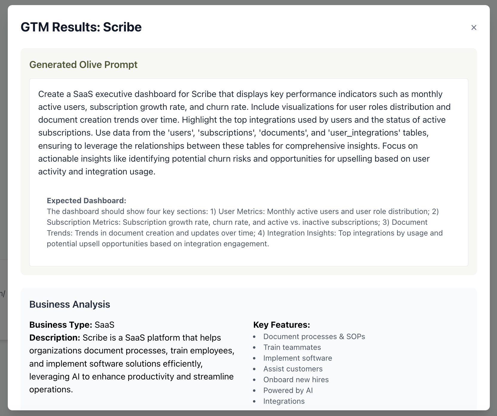

# Olive GTM Engine

Workflow to research Olive's potential customers, generate their database schema with sample data, and create customized dashboards for leads on Olive's staging platform.

See short demo: https://youtu.be/6TtcydM7MoI?si=nYBDchMOngg2HXYm.

**Stage 1: Claude Code SDK Analysis + Neon MCP**
- Claude researches the company through conversational analysis with the Agent SDK
- Uses Neon MCP server to create PostgreSQL database
- Generates realistic sample data based on business model
- Saves database connection string and schema information

**Stage 2: OpenAI Structured Output**
- Passes the Claude output into OpenAI
- Generates 3 structured tool suggestions, each with corresponding prompt and key features
- Uses OpenAI's 'structured output' to ensure JSON output format



**Stage 3: Olive Integration**
- Creates dashboard on Olive's staging platform with the generated prompts via connecting to Olive's API endpoints (including connecting database)
- Returns the app URLs for direct viewing on Olive's platform

## Installation

### Setup

1. **Clone the repository**

2. **Backend setup**
   ```bash
   cd backendv3
   pnpm install
   ```

3. **Create `.env` in `backendv3/`**
   ```env
   OPENAI_API_KEY=your_openai_api_key_here
   ANTHROPIC_API_KEY==your_anthropic_api_key_here
   ```

4. **Frontend setup**
   ```bash
   cd frontendv3
   npm install
   ```

## Run the App

### Option 1: CLI

```bash
cd backendv3
pnpm dev <company_name> <website_url>

# Example:
pnpm dev Toast https://pos.toasttab.com/
```

**Output**: Results saved to `backendv3/data/` as JSON files

### Option 2: Server w/ Frontend

**Backend**
```bash
cd backendv3
pnpm run server
```

**Frontend**
```bash
cd frontendv3
npm start
```

## Sample Output

#### Stage 1: Claude Analysis
```json
{
  "company_analysis": {
    "business_description": "...",
    "target_customers": "...",
    "likely_data_needs": [...]
  },
  "connection_string": "postgresql://...",
  "database_info": {
    "schema": [...]
  }
}
```

#### Stage 2: Structured Output
```json
{
  "tool_suggestions": [
    {
      "title": "Customer Analytics Dashboard",
      "prompt": "Create a dashboard that...",
      "features": ["Real-time metrics", "..."]
    }
  ]
}
```

#### Stage 3: Olive Integration
```json
{
  "app_urls": [
    "https://soon.olive.com/app/123",
    "https://soon.olive.com/app/124"
  ]
}
```

## Tech Stack

- **Frontend**: React, TypeScript, Tailwind CSS
- **Backend**: Express.js, TypeScript, Node.js
- **AI Services**: Claude Code's Agent SDK (research & database creation), OpenAI GPT-4 (structured output for tool suggestions)
- **Database**: Neon PostgreSQL (cloud, created via MCP)
- **Storage**: Local JSON files (for now)

## Data Storage

Results are stored in `backendv3/data/`:

- `{company-name}.json` - Claude analysis output with database connection info
- `{company-name}-structured.json` - OpenAI structured output with tool suggestions
- **Resume Feature**: The code automatically checks /data before running - if analysis already exists for a company, it is reused to save time.